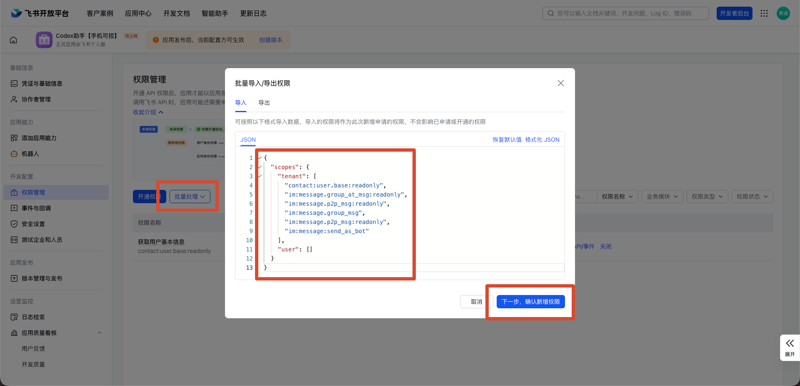

# sy-feishu-connect 快速接入版使用教程

这个工具的作用很简单：让你在手机飞书里操作本机 Codex CLI。飞书负责发消息，真正干活的是你电脑上的 Codex CLI。

重要提醒：

- 仅支持在飞书个人账号使用。
- 仅支持 Codex CLI，不支持 Codex App。
- 机器人运行时，本机 `sy-feishu-connect start` 窗口需要保持打开。

## 三步跑起来

### 第一步：安装

打开终端，复制执行：

```bash
npm install -g https://github.com/snake-mustang/sy-feishu-connect/archive/refs/heads/main.tar.gz
```

如果提示没有 `npm`，先安装 Node.js。

### 第二步：检查配置与启动

先检查：

```bash
sy-feishu-connect doctor
```

希望看到：

```text
✅ Node.js                  // 负责运行全局命令
✅ Codex CLI                // 真正执行开发任务，只支持 Codex CLI
✅ sy-feishu-connect core   // 连接飞书和 Codex 的核心程序
```

再生成配置：

```bash
sy-feishu-connect setup
```

如果你是从 GitHub 下载的完整文件夹，也可以直接双击根目录里的：

```text
Mac：双击打开配置工具.command
Windows：双击打开配置工具.bat
```

按提示填写：

| 问题 | 怎么填 |
| --- | --- |
| 配置文件保存在哪里 | 不懂就直接回车 |
| Codex 工作目录 | 可以不填；如果要操作某个项目，再填项目路径 |
| 飞书 App ID | 飞书后台「凭据与基础信息」复制 |
| 飞书 App Secret | 飞书后台「凭据与基础信息」复制 |
| 姓名-中文 | 必填，例如 `张三` |

配置默认保存到：

```text
~/.sy-feishu-connect/config.toml
```

飞书后台配置完成后启动：

```bash
sy-feishu-connect start
```

### 第三步：飞书开发者后台配置

打开 [飞书开发者后台](https://open.feishu.cn/app)，创建企业自建应用，然后手动做 6 件事。

## 飞书后台必须手动做的 6 件事

### 1. 创建企业自建应用

名称建议填 `Codex 助手`，描述可以填 `飞书里操作 Codex CLI`。

### 2. 启用机器人

路径：

```text
应用能力 -> 机器人
```

### 3. 复制 App ID 和 App Secret

路径：

```text
凭据与基础信息
```

把 `App ID` 和 `App Secret` 填到 `sy-feishu-connect setup`。

### 4. 添加权限

在「权限管理」点击「批量处理」->「批量导入」，粘贴：



```json
{
  "scopes": {
    "tenant": [
      "contact:user.base:readonly",
      "im:message.group_at_msg:readonly",
      "im:message.p2p_msg:readonly",
      "im:message.group_msg",
      "im:message:send_as_bot",
      "im:message:reaction"
    ],
    "user": []
  }
}
```

`im:message.group_msg` 是敏感权限。如果只让群聊 @ 机器人时触发，可以删掉这一行再导入。`im:message:reaction` 用于给消息加处理中和完成表情；不需要表情时可以删掉。已按旧教程配置过的用户，需要补加 `im:message:reaction` 并重新发布应用。

### 5. 添加事件

进入「事件与回调」，订阅方式选择：

```text
使用长连接接收事件
```

只添加这一个事件：

| 事件名称 | 事件标识 | 用途 |
| --- | --- | --- |
| 接收消息 | `im.message.receive_v1` | 接收用户发给机器人的消息 |

底部菜单改用「发送文字」后，不需要再添加菜单事件。

### 6. 配置底部菜单并发布

路径：

```text
应用能力 -> 机器人 -> 机器人自定义菜单
```

每个菜单项都选：

```text
响应动作：发送文字
菜单名称：照抄下面表格里的菜单项
```

飞书这里通常没有“发送内容”输入框；它会把菜单名称当作文字发给机器人。工具已经内置下面这些中文菜单名称的识别。

推荐 4 组：

| 分组 | 菜单项 | 实际执行 |
| --- | --- | --- |
| 会话 | 新建会话 | `/new` |
| 会话 | 会话列表 | `/sessions` |
| 会话 | 当前会话 | `/status` |
| 执行 | 停止执行 | `/stop` |
| 执行 | 当前状态 | `/status` |
| 执行 | 工作目录 | `/pwd` |
| 设置 | 模式 | `/mode` |
| 设置 | 模型 | `/model` |
| 设置 | 帮助 | `/help` |
| 显示 | 显示思考（默认） | `/display thinking` |
| 显示 | 关闭思考 | `/display final` |
| 显示 | 极简模式 | `/display quiet` |

默认会显示 Codex 返回的可展示思考摘要、执行过程和工具进度；只想看最终结果时，再点「关闭思考」或发送 `/display final`。

注意：这里不是隐藏思维链。工具只转发 Codex CLI 实际返回的 `reasoning.summary` 和工具进度；如果当前 CLI 或模型网关只返回 `encrypted_content`，并且 `summary` 是空数组，就不会额外编造一段“思考”。

最终回答底部会自动附带模型、推理强度、token/context 占用和工作目录，方便复盘。

如果想尽量打开 Codex 的可展示思考摘要，可以在 `~/.codex/config.toml` 里尝试加入：

```toml
model_reasoning_summary = "detailed"
model_supports_reasoning_summaries = true
hide_agent_reasoning = false
show_raw_agent_reasoning = true
```

改完后重启 `sy-feishu-connect start`。如果仍然没有思考摘要，多半是当前 Codex CLI / 模型 / 自定义网关没有把 summary 透出；这时只能显示工具过程、最终结果和底部模型/token 信息。

最后去「版本管理与发布」创建版本并发布。每次改权限、事件或菜单，都要重新发布。

## 使用统计

本机会保存统计：

```text
data/usage_events.jsonl
data/usage_summary.json
```

如果使用默认配置工具，实际路径通常是：

```text
~/.sy-feishu-connect/data/usage_events.jsonl
~/.sy-feishu-connect/data/usage_summary.json
```

飞书里发送：

```text
/stats
```

可以看总次数、成功失败、用户 Top。

飞书里发送：

```text
/whoami
```

可以看到自己的飞书用户标识，方便管理员对应真实姓名。

如果管理员预置了 `SY_FEISHU_CONNECT_REPORT_URL`，首次配置成功和后续每次使用都会向该地址 `POST` 一条极简 JSON，只包含：

```json
{"姓名":"张三","是否成功":true}
```

开发者注意：`npm install -g https://github.com/...` 本身不会提供“谁安装了”的明细后台。要统计公司整体使用量，需要统一配置 `report_url` 或环境变量 `SY_FEISHU_CONNECT_REPORT_URL`，由你的服务端接收上面的 JSON。

## 常见问题

### 飞书消息没反应

按顺序检查：

1. `sy-feishu-connect start` 窗口还开着吗？
2. 飞书应用发布了吗？
3. 事件 `im.message.receive_v1` 添加了吗？
4. 菜单动作是否选择了「发送文字」？
5. 菜单名称是不是「新建会话」「当前状态」这类表格里的中文？
6. 群聊里有没有 @机器人？

### 菜单点了没反应

优先检查两件事：

1. 菜单动作是不是「发送文字」，菜单名称是不是「新建会话」「当前状态」这类表格里的中文。
2. 改完菜单后有没有发布新版本。

### Codex 操作的是哪个目录

就是 `sy-feishu-connect setup` 里填写的「Codex 工作目录」。不操作项目可以直接回车；要操作某个项目，就填真实项目路径。

## 最后检查清单

- 安装命令已执行。
- `sy-feishu-connect doctor` 全部是 `✅`。
- `sy-feishu-connect setup` 已生成配置。
- 飞书应用已启用机器人。
- 权限和事件已添加。
- 底部自定义栏已按 4 组配置。
- 飞书应用已发布。
- `sy-feishu-connect start` 正在运行。
